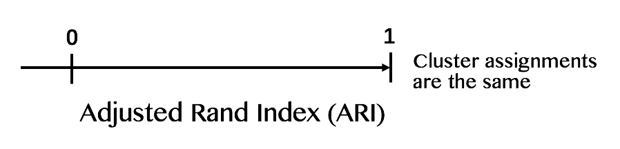

The Rand Index is a measure of similarity between two clustering assignments. Measured on a scale of $0−1$, a larger Rand Index corresponds to more similar clustering assignments.

In the Shiny app, we implement the **Adjusted Rand Index (ARI)**, which is an adaptation from Rand Index that adjusts for the chance grouping of elements (if the grouping is similar by randomness). ARI is usually observed on a scale of $0−1$, but can be negative if the agreement between two clustering assignments is less than what we would expect from random cluster assignments.