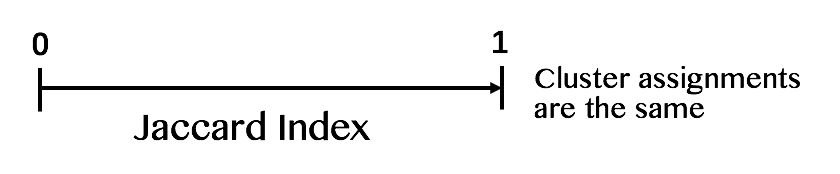
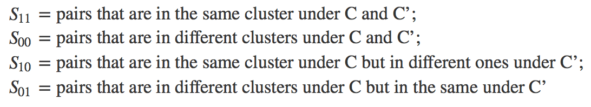

**Jaccard Index**, also known as Intersection over Union, is an easily-calculated statistic used for measuring the similarity and dissimilarity between two clustering assignments. It is very similar to the Rand Index; however, it disregards the pairs of elements that are in different clusters for both clusterings. (Wagner and Wagner 2007)

On a scale of $0-1$, Jaccard Index is defined as:

  
In this setting, if we have two sets of clustering assignments C and C’:

$$J(C,C')=\frac{n_{11}}{n_{11}+n_{10}+n_{01}}$$

where

	
and

$$n_{ab}:=\left|S_{ab}\right| \;\; \text{denote respective sizes.}$$