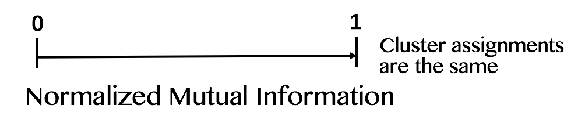
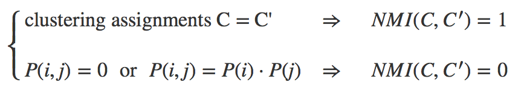

Assume a set of n observations X contain k clusters, where $k \in (1,n), k \in \mathbb{Z}$, and all elements of X have the same probability of being picked. If we choose an element of X at random, the probability that this element is in cluster C is $P(i)=\frac{\left|C\right|}{n}$.

The probability that an element belongs to cluster S in the first clustering assignment and cluster T in the second clustering assignment is likewise denoted as $P(i,j)$, where $P(i,j)=\frac{|S\cap T|}{n}$.

The **entropy** of a clustering C is a measure for the uncertainty about the cluster of a randomly picked element. (Meilã 2007) The entropy associated with clustering C is:

$$H({C})=-\sum_{i=1}^{k} P(i)logP(i)$$

The notion of entropy can be extended to that of **mutual information**, which describes how much we can on average reduce the uncertainty about the cluster of a random element when knowing its cluster in another clustering of the same set of elements.  The mutual information between two clustering assignments C, C’ is defined as:

$$I(C,C')=\sum_{i=1}^{k} \sum_{j=1}^{l} P(i,j) log\frac{P(i,j)}{P(i)P(j)}$$

The R package *partitionComparison* that we adopt implements the algorithm of **Normalized Mutual Information** by Fred & Jain. It is defined as follows:

$$NMI(C,C')=\frac{2I(C,C')}{H({C})+H(C')}$$

where

$$0 \le NMI(C,C') \le 1$$

We have:

