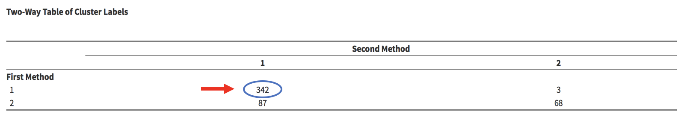
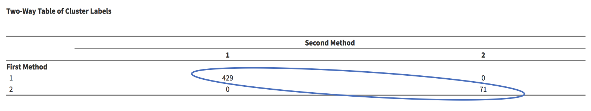

Two-way tables display the distribution of cluster assignments when comparing cluster assignments. The vertical axis represents the first cluster assignment input by the user; the horizontal axis represents the second. 

The top left number, 342 for instance, shows the number of observations that are in Cluster 1 in the first assignment and Cluster 1 in the second assignment.

If two cluster assignments are identical, the sum of the diagonal ($429 + 71$) should match the total number of observations ($500$) (off-diagonal entries sum to 0).

