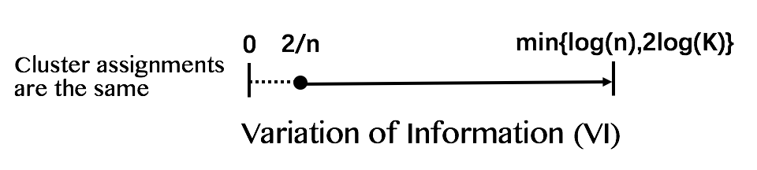
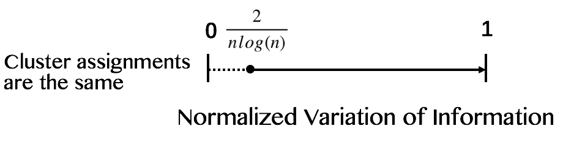

Following up on the idea of entropy and mutual information, Meilã (2006) proposes an alternative information based distance **Variation of Information $(VI)$** defined as follows:

$$VI(C,C’) = H({C}) + H(C’) - 2I(C,C’)$$

The VI metric is always non-negative and only reaches 0 when clustering assignments $C = C’$. $VI(C,C’)$ is bounded by following properties:

- $VI(C,C’) \le log(n)$, where $n =$ number of observations in the dataset.

- $VI(C,C’) \le 2log(K)$ if $C$ and $C’$ have at most $K$ clusters each, where $K \le \sqrt{n}$.

- $VI(C,C’) \ge \frac{2}{n}$ for all $C \neq C’$.

Thus, we have:

  
Based on the properties of $VI$ metric proposed by Meilã (2006) above, she furthered with two possibilities to scale Variation of Information.

- $VI(C,C’) \le log(n) \Rightarrow V(C,C’) = \frac{1}{log(n)} VI(C,C’)$ 

This applies if we limit our comparison of clusterings to one dataset.

- $VI(C,C’) \le 2log(K) \Rightarrow V_{K}(C,C’) = \frac{1}{2log(K)} VI(C,C’)$

Such normalization will preserve comparability between datasets. However, the meaning of $K$ is different across datasets.

&nbsp;

Given that the comparison across datasets wouldn't be contextually meaningful, we decide to scale $VI$ by $\frac{1}{log(n)}$. 

We finally have **Normalized Variation of Information**, where, different from other indices, $0$ represents identical cluster assignments:

