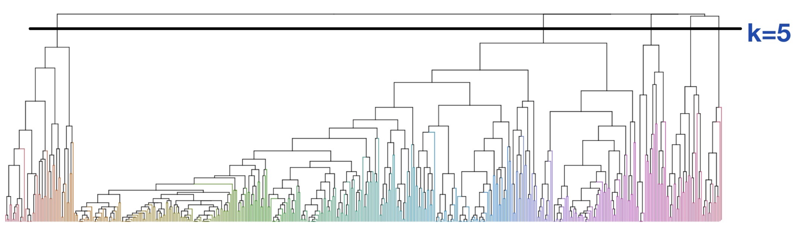

The idea of hierarchical clustering is illustrated via the usage of dendrograms. For a set of n observations, we start with n clusters (meaning each observation is by itself a cluster). At each step, we merge some similar observations into branches, forming a tree. As we move higher up the tree, branches merge with other branches or observations until only one cluster is left. One advantage of hierarchical clustering is that we do not have to pre-specify the number of clusters *k*. Below is an example of a dendrogram depicting a hierarchical clustering. 

  
$$\text{We can arbitrarily set the number of clusters, k = 5 for instance, as we move the line up and down.}$$