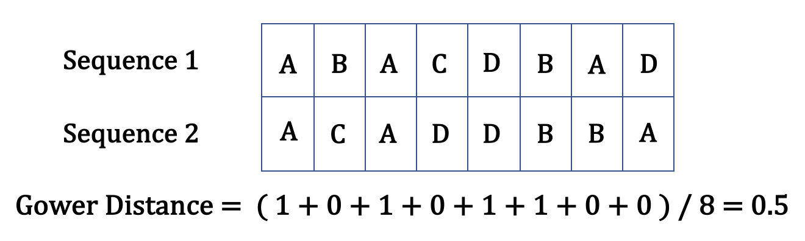

A common practice to measure disimilarity when clustering datasets of mixed-type data is **Gower distance**, where two individuals $i$ and $j$ may be compared on a character $k$ and assigned a score $s_{ijk}$. For qualitative characters, we set $s_{ijk} = 1$ if the two sequences $i$ and $j$ agree and $s_{ijk} = 0$ if they differ in the $k^{th}$ time point. The dissimilarity between two sequences is the weighted mean of the scores $s_{ijk}$ with weights $w_k \delta_{ijk}$, where $w_k = \texttt{weights[k]}$, $\delta_{ijk}$ is 0 if there is missing data in either sequence or 1 otherwise, which allows sequences to be aligned on a day-to-day basis. Specifically,

$$d(i,j) = \frac{\sum_{k=1}^p s_{ijk} w_k \delta_{ijk}}{\sum_{k=1}^p w_k \delta_{ijk}}$$

In our setting, assume all weights are equal. If each capital letter represents a distinctive state, 4 out of 8 positions have overlapping states. Therefore, the Gower distance is $4 / 8 = 0.5$.

