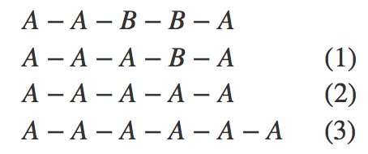
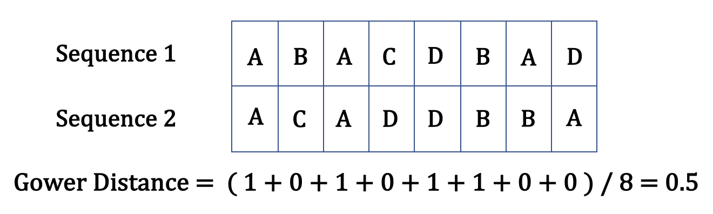

Edit distance is an overarching concept where we quantify the cost of transforming between two sequences. Take two sequences $“A−A−B−B−A”$ and $“A−A−A−A−A−A”$ as an example. It takes three operations to change from the first to the second sequence: we first substitute the first $“B”$ in the first sequence to $“A”$ (*substitution*), then substitute the second $“B”$ in the first sequence to $“A”$ (*substitution*) and finally add $“A”$ to the end of the sequence (insertion/deletion called *indel*). (Studer and Ritschard 2016)

&nbsp;

A common practice to measure disimilarity when clustering datasets of mixed-type data is **Gower distance**, where two individuals $i$ and $j$ may be compared on a character $k$ and assigned a score $s_{ijk}$. (Gower 1971) For qualitative characters, we set $s_{ijk} = 1$ if the two sequences $i$ and $j$ agree and $s_{ijk} = 0$ if they differ in the $k^{th}$ time point. The dissimilarity between two sequences is the weighted mean of the scores $s_{ijk}$ with weights $w_k \delta_{ijk}$, where $w_k = \texttt{weights[k]}$, $\delta_{ijk}$ is 0 if there is missing data in either sequence or 1 otherwise, which allows sequences to be aligned on a day-to-day basis. Specifically,

$$d(i,j) = \frac{\sum_{k=1}^p s_{ijk} w_k \delta_{ijk}}{\sum_{k=1}^p w_k \delta_{ijk}}$$

In our setting, assume all weights are equal. If each capital letter represents a distinctive state, 4 out of 8 positions have overlapping states. Therefore, the Gower distance is $4 / 8 = 0.5$.

&nbsp;

**Generalized Hamming Distance**

This method allows for substitution costs depending on the frequency of states, but no insertions or deletions. As such, two sequences must be of the same length.

**Optimal Matching**

Optimal Matching allows for user-assigned costs to each operation of substitution or indel. As such, sequences can be of different lengths. One may notice that the first substitution and the second substitution are not equally important. Step (1) merely changes the length of the spell, while step (2) eliminates event $“B”$ from the sequence. To address such problems, more specialized algorithms of edit distance were created to ensure that each operation is assigned an appropriate cost. One example is **Optimal Matching sensitive to spell length**.

&nbsp;

The important question is how initial indel and substitution costs should be set. Based on data-driven methods by Studer and Ritschard (2014), we calculate substitution costs from observed transition rates and indel costs from the relative observed frequency of each state. To meet the triangle inequality, we set the lowest indel cost to $1$ and the highest substitution cost to $2$, then rescale other costs proportionally.
